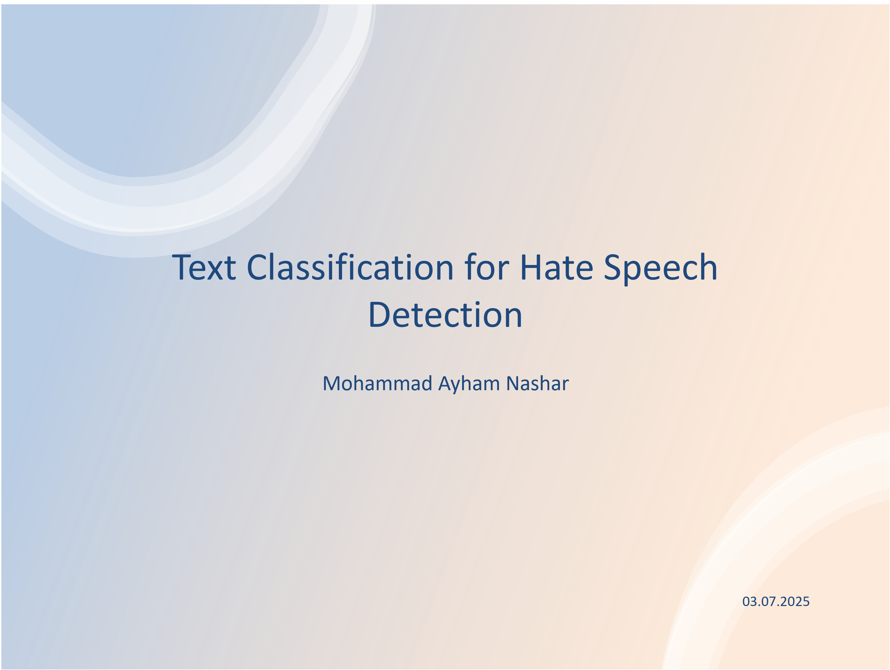

# PsyText: Hate Speech and Offensive Language Detection

## Repository Link

[https://github.com/ayhamnashar/PsyText]

## Description

PsyText is a machine learning project focused on detecting hate speech and offensive language in social media text. The goal is to classify tweets into three categories: Hate Speech, Offensive Language, or Neither. The project compares traditional machine learning models with a deep learning approach to evaluate their effectiveness on this task.

### Task Type

Text Classification

### Results Summary

- **Best Model:** Linear SVM (Support Vector Machine)
- **Evaluation Metric:** Accuracy (also compared F1-score and recall)
- **Result:** Linear SVM achieved ~89.1% accuracy on the test set. The neural network achieved ~79.4% accuracy.

## Documentation

1. **[Literature Review](0_LiteratureReview/README.md)**
2. **[Dataset Characteristics](1_DatasetCharacteristics/exploratory_data_analysis.ipynb)**
3. **[Baseline Model](2_BaselineModel/baseline_model.ipynb)**
4. **[Model Definition and Evaluation](3_Model/model_definition_evaluation)**
5. **[Presentation](4_Presentation/README.md)**

## Cover Image

